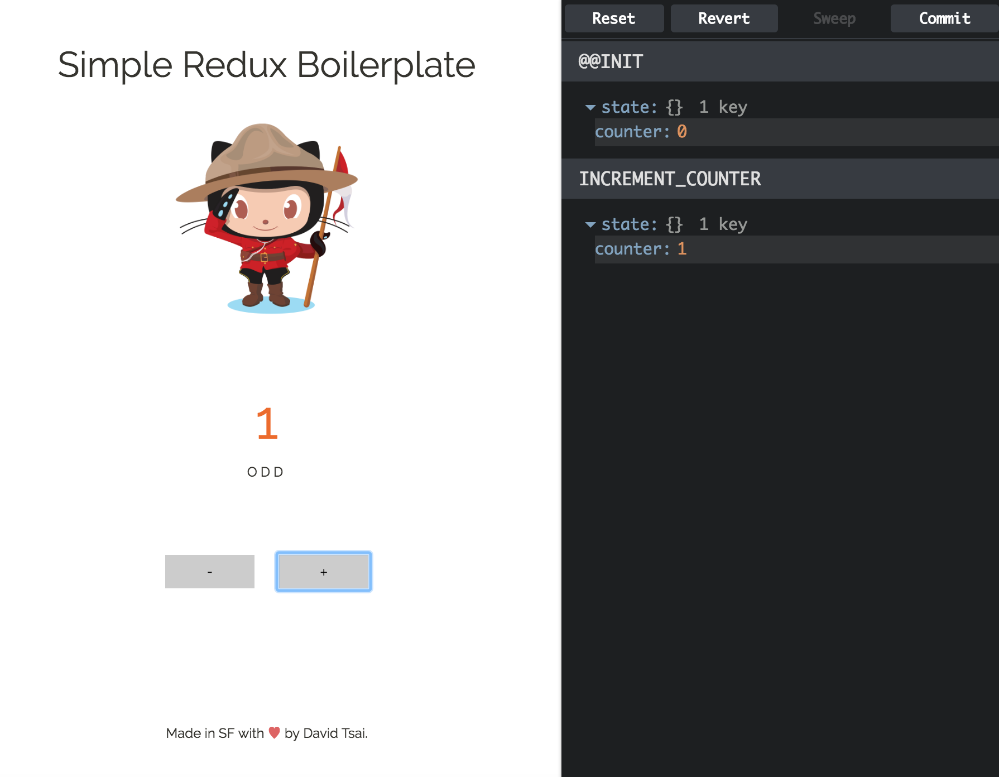

# Simple Redux Boilerplate Fork 

This is a fork of the excellent [Simple Redux Boilerplate](https://github.com/tsaiDavid/simple-redux-boilerplate) by 
[@tsaiDavid](https://github.com/tsaiDavid/).

I enjoyed working through his example but got stuck when I wanted to start experimenting with images. I wanted to demo the difference between loading them via Webpack or Express depending if they are included or external assets respectively. 

I would recommend starting with David's version first and when you're ready for images you might consider looking at this work afterwards. 

[demo](http://www.headwinds.net/lab/redux/image-counter/)